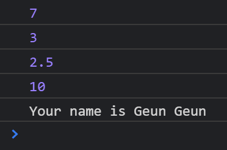

# 2021.10.23(SAT) 노마드 코더 바닐라 JS로 크롬 앱 만들기 강의

## 2.3 const and let

- const : 상수(constant), 값이 바뀔 수 없음
- let : 값이 바뀔 수 있음
- var : 오래된 자바스크립트 코드의 경우 사용하는 경우가 종종 있다. 하지만 되도록이면 `const`와 `let`을 사용하도록 한다. var은 변수에 대한 자세한 정보를 알려주지 못한다. 반면에, const와 let은 변수가 변경될 수 있는지(`let`) 혹은 변경될 수 없는지(`const`)에 대한 정보를 알려준다.

```JavaScript
// const a = 5;
// const b = 2;
// const myName = 'Geun';

const a = 5;
const b = 2;
let myName = 'Geun';

console.log(a + b);
console.log(a - b);
console.log(a / b);
console.log(a * b);

myName = 'Geun Geun';

console.log("Your name is", myName);
```

### 출력 결과

- `let`을 사용하여 `myName` 변수 값이 변경된 것을 확인할 수 있다.

### Reference
> https://nomadcoders.co/javascript-for-beginners/lectures/2876
